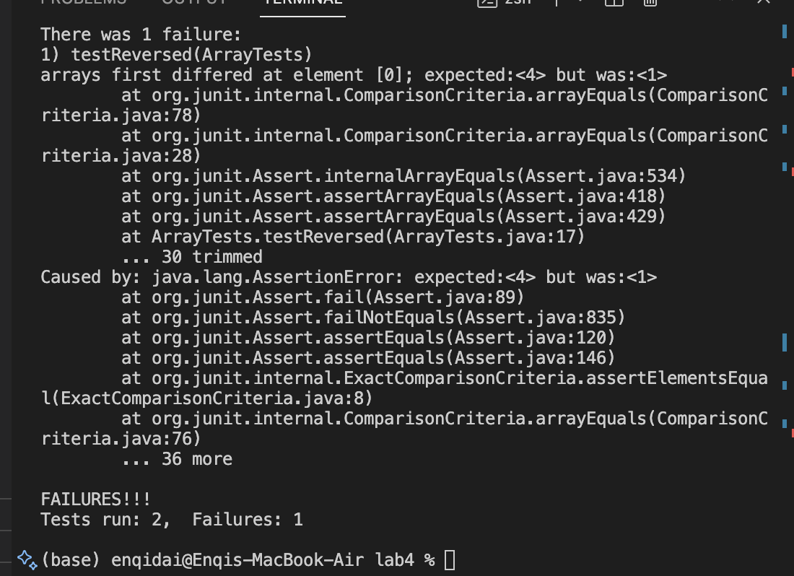

Part 1:
1. The failure inducing input for the reversed() method of ArrayExamples:
```
@Test
  public void testReversed() {
    int[] input1 = {1,2,3,4 };
    ArrayExamples.reversed(input1);
    assertArrayEquals(new int[]{ 4,3,2,1 }, input1);
  }
```
The bug is that the method is returning the original array instead of the new one and the old array was getting updated which doesn't have any elements in it.
 2. The input doesn't induce a failure:
 ```
@Test
  public void testReversed() {
    int[] input1 = {1 };
    ArrayExamples.reversed(input1);
    assertArrayEquals(new int[]{ 1 }, input1);
  }
```

3. The symptom for the method


4. The bug(two codes blocks)
   ```
    static int[] reversed(int[] arr) {
    int[] newArray = new int[arr.length];
    for(int i = 0; i < arr.length; i += 1) {
      newArray[i] = arr[arr.length - i - 1];
    }
    return newArray;
  }
  ```

    static int[] reversed(int[] arr) {
    int[] newArray = new int[arr.length];
    for(int i = 0; i < arr.length; i += 1) {
      arr[i] = arr[arr.length - i - 1];
    }
    return newArray;
```
 part 2:Option 1: -name
Description: This option allows you to search for files and directories with a specific name.

Example 1: Finding files with a specific name


find ./technical -name "README.md"
Output:


./technical/README.md
./technical/subdirectory/README.md
Explanation: This command searches the ./technical directory and its subdirectories for files named README.md.

Example 2: Finding directories with a specific name


find ./technical -type d -name "images"
Output:


./technical/subdirectory/images
Explanation: This command searches the ./technical directory and its subdirectories for directories named images.

Source: I learned about the -name option from the Linux man page for find: man7.org/linux/man-pages/man1/find.1.html

Option 2: -type
Description: This option allows you to filter results based on file type (regular file, directory, symbolic link, etc.).

Example 1: Finding only directories


find ./technical -type d
Output:

./technical
./technical/subdirectory
./technical/subdirectory/images
Explanation: This command searches the ./technical directory and its subdirectories, returning only directories.

Example 2: Finding only symbolic links


find ./technical -type l
Output:


./technical/link_to_file
Explanation: This command searches the ./technical directory and its subdirectories, returning only symbolic links.

Source: The -type option is documented in the find manual page: man7.org/linux/man-pages/man1/find.1.html
  }
  ```
  


